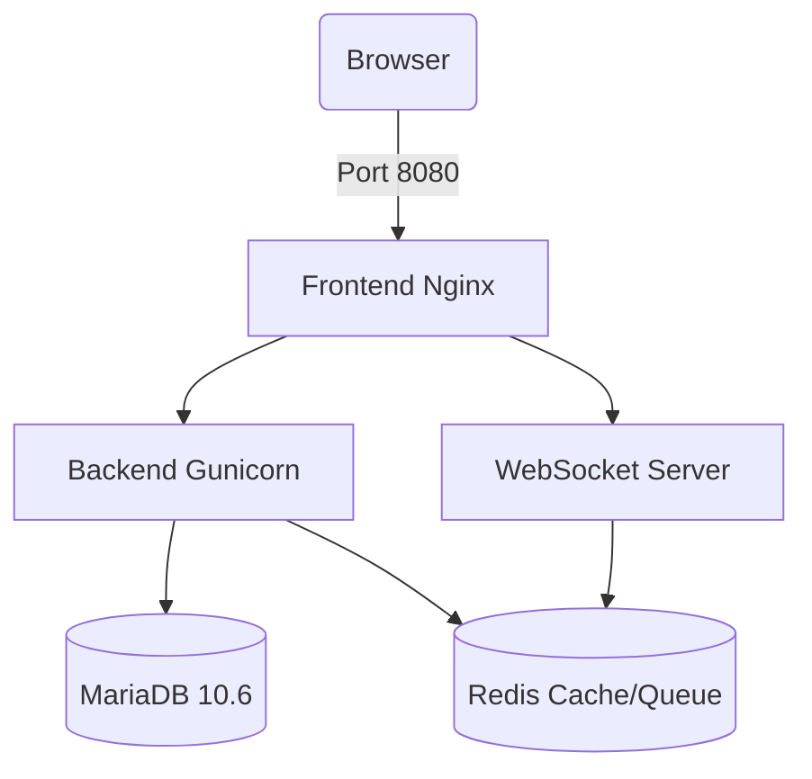

# Technical Documentation: Agency Procurement System (ERPNext v15)

## 1. Architecture Overview
This system is a Dockerized instance of ERPNext v15, designed as a white-labeled "Agency Procurement System". Key infrastructure components:

*   **App Server**: `frappe/erpnext:v15` (Latest Stable)
*   **Database**: `mariadb:10.6` (Persistent volume: `mariadb-data`)
*   **Cache/Queue**: `redis:6-alpine` (Separate services for cache and queue)
*   **Web Server**: Nginx (Internal to the container)
*   **Reverse Proxy**: Frontend container acting as the entry point.

### Infrastructure Diagram

## 2. Configuration Details
### Networking & Ports
*   **Frontend**: Exposed on `localhost:8080`
*   **Backend**: Internal `8000`
*   **Database**: Internal `3306` (Not exposed to host for security)
*   **Redis**: Internal `6379`

### Persistence
*   **Sites Volume**: `./sites` -> `/home/frappe/frappe-bench/sites`
    *   Stores site config, file uploads (`public/files`, `private/files`).
*   **Logs Volume**: `./logs` -> `/home/frappe/frappe-bench/logs`
*   **DB Volume**: `mariadb-data` (Docker internal volume)

## 3. Customizations
### "Procurement Only" Lockdown
To satisfy the requirement of a restricted UI for agency users, we implemented a two-fold strategy:

1.  **Server-Side Logic (Security)**:
    *   A Python **Server Script** hooks into the `User` DocType (`Before Save` event).
    *   It automatically updates the `block_modules` table for any user who is NOT "Administrator".
    *   **Allowed Modules**: Buying, Stock, Quality, Settings.
    *   **Blocked Modules**: All others (Accounting, CRM, HR, etc.) are programmatically added to the block list.

2.  **Client-Side UI (UX)**:
    *   Instead of fragile JavaScript hacks, we utilize native **Role Permissions**.
    *   **Configuration**: To hide the "Create Workspace" (+) button and "Edit" features, agency users must **NOT** have the "System Manager" or "Workspace Manager" roles.

## 4. Troubleshooting History
During setup, the following environment-specific issues were resolved:

*   **Localhost Resolution**: Nginx in the frontend container required the `FRAPPE_SITE_NAME_HEADER=localhost` environment variable to correctly map requests to the site.
*   **Redis Connection**: The `common_site_config.json` initially pointed to `localhost` (127.0.0.1) for Redis. This was incorrect for Docker. We updated it globally to point to the `redis-cache` and `redis-queue` service hostnames.
*   **Server Scripts**: By default, Server Scripts are disabled. we enabled them globally via `bench set-config -g server_script_enabled 1`.
